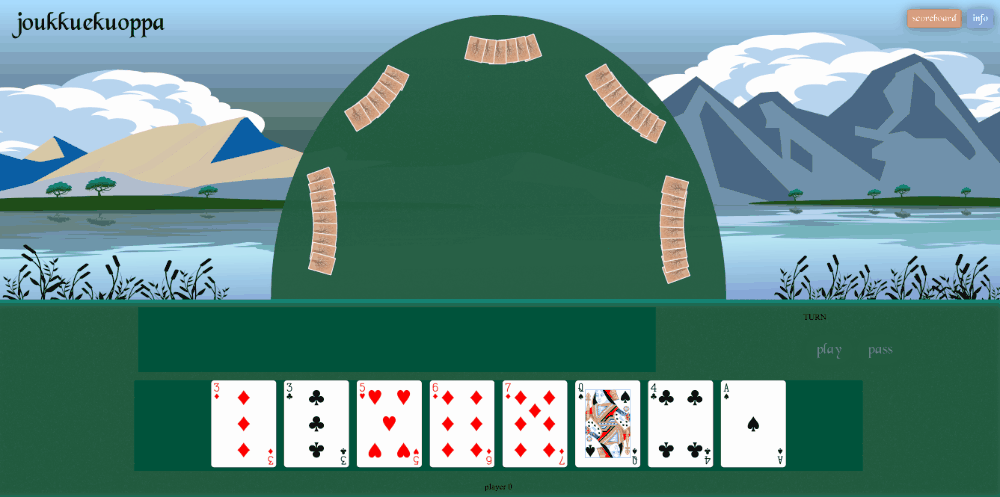
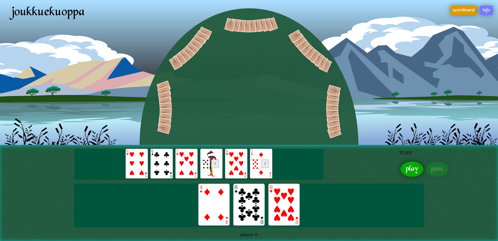
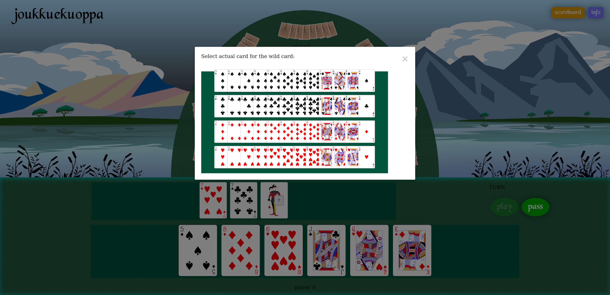
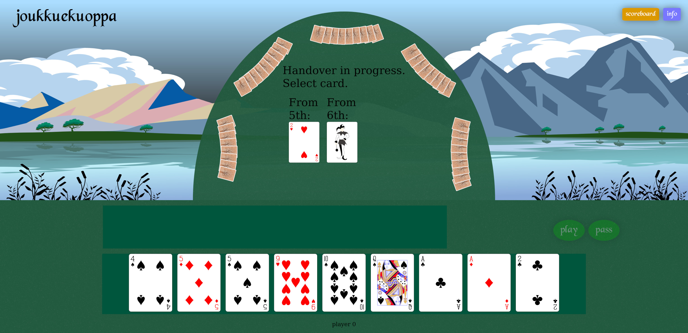
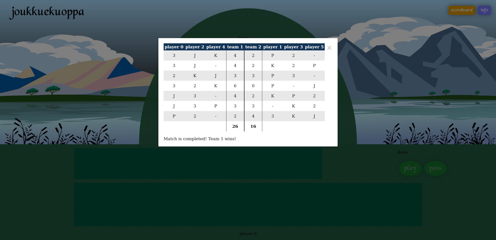

<div align="center">
  <h3 align="center">joukkuekuoppa</h3>
  <p align="center">
    Online multiplayer implementation of Joukkuekuoppa, a 3 vs 3 variant of Zheng Shangyou / Pits.
  </p>
</div>

## Version History

* 1.0.1 (Feb 2025): Improved lower resolution layout scaling and fixed a logic issue with handovers.
* 1.0.0 (Jan 2025): Initial version.

## About

### Gameplay Example
<div align="center">
  <a href="media/kuoppa.gif"></a>
</div>

### Gallery
<div align="center">
  <a href="media/doublestraight.jpg"></a>
  <a href="media/wildcardselection.jpg"></a>
  <a href="media/handover.jpg"></a>
  <a href="media/points.jpg"></a>
</div>

### Game Info

For rules and other background information on Zheng Shangyou and its variants, see <a href="https://www.pagat.com/climbing/shangyou.html">here</a>.

### Contents

In approximately 3k lines of TypeScript and Vue code:
* Client-server architecture:
  * The server maintains the game state and provides service interface for making plays.
  * Reactive client UI, with drag-and-drop on player cards and animations on plays.
* Minimalist lobby for starting games and changing settings.
* Player action validation with complete game ruleset.
* Wildcard selections and usage.
* Card handovers between rounds.
* Automatic scoring.
* AI players.
* Some unit tests for server side and common utilities code.

## Structure

On a coarse level, the code is organized into three subareas, each with their own directory:
* <b>server</b>: Maintains the game state and provides service interface for making plays. Also runs AI players.
* <b>client</b>: Provides reactive client UI.
* <b>common</b>: Data structure definitions and utility procedures that both the 'server' and the 'client' use.

Further breakdown of the file structure of these subareas:

### common

| Path | Description |
| - | - |
| src/Card.ts | Card data structure definition. |
| src/Constants.ts | Commonly used constants definition. |
| src/GameSettings.ts | Game settings (e.g. which players are human/AI controlled) data structure definition. |
| src/GameState.ts | Game state data structure definition. |
| src/Player.ts | Player related game state data structure definition. |
| src/Rules.ts | Rules of the game, i.e. validity of plays, scoring mechanism, etc. |
| src/Utilities.ts | Miscellaneous utility procedures. |
| tests/Card.test.ts | Unit tests for the Card class. |
| tests/Rules.test.ts | Unit tests for the rules. |

### server
| Path | Description |
| - | - |
| src/AI.ts | AI controlled player behavior. |
| src/Actions.ts | Procedures for different kinds of plays that can be done in the game. |
| src/Random.ts | Procedures that utilize random generation (such as deck shuffling utilities). |
| src/server.ts | Server service interface and launch implementation. |
| tests/Actions.test.ts | Unit tests for the procedures for different kinds of plays. |

### client
| Path | Description |
| - | - |
| src/components/GameComponent.vue | Main game UI content definition. |
| src/components/LobbyComponent.vue | Lobby UI content defition. |
| src/components/ModalComponent.vue | Reusable base for creating modal screens in the UI. |
| src/components/utils/FlipTechnique.ts | Simple implementation of "FLIP technique" for card animation (see file contents for a link to further information). |
| src/components/utils/Misc.ts | Miscellaneous utility procedures. |
| src/components/utils/ServerCalls.ts | Utility class for cleaner interface on server calls that are made by the components. |
| src/assets/ | SVG files for the various graphics used in the client. |

Additionally, there are several files for node/npm package configuration, TypeScript compilation options, Vite configuration, etc.

## Known Issues / Future Work

* Player names should be configurable and shown more clearly, e.g. during handovers.
* Hovering over various UI elements could give additional information, e.g. who has played the last group.
* AI players should utilize more strategic thinking.
* Turn indication could be visualized more clearly, especially during handovers.
* Some UI elements can go over interaction elements, preventing actions on them. z-ordering should be improved.
* The use of the BlackChancery font gives a few warnings/errors, at least in Firefox console, such as:
"downloadable font: hdmx: the table should not be present when bit 2 and 4 of the head->flags are not set".
The font itself is rendering satisfactorily.

Additional "todo" details are available in the code with the '@todo' tag.

## How to Run

To run the server, in 'server' directory:
```sh
npm update
npx ts-node src/server.ts
```

To run the client (through Vite), in 'client' directory:

* In package.json file, replace [enter production address] with the address of the server.
*
  ```sh
  npm update
  sudo npm run production
  ```

Unit tests are currently using <a href="https://jestjs.io/">Jest</a>.

To run unit tests for common code, in 'common' directory:
```sh
npm update
npm test
```

To run unit tests for server, in 'server' directory:
```sh
npm update
npm test
```

## Credits

Code written by the author.

Uses 
<a href="https://nodejs.org/">Node.js</a>, 
<a href="http://expressjs.com/">Express</a>, 
<a href="https://vuejs.org/">Vue.js</a>, 
<a href="https://github.com/SortableJS/Vue.Draggable">Vue.Draggable</a>, 
<a href="https://jestjs.io/">Jest</a>.

Uses the BlackChancery font, which is public domain according to https://www.1001fonts.com/blackchancery-font.html.

Felt graphics are by the author. "nnnoise: Online SVG Noise Texture Generator" (https://www.fffuel.co/nnnoise/) has been used as part of the process.

Card graphics (apart from the jokers and backsides) are from https://www.me.uk/cards/ and are public domain according to the site.

Joker card graphics, card backside graphics, and the background landscape graphic are derived works by the author, combining and modifying several public domain SVG source files from sites such as https://freesvg.org/.

## License

See LICENSE.md.
